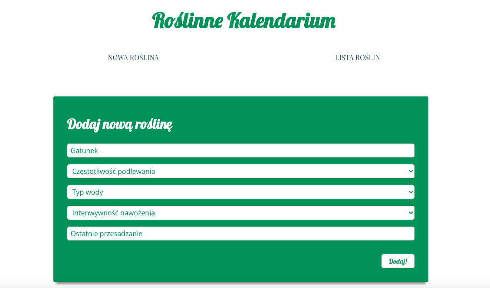

# Roślinne Kalendarium

Roślinne Kalendarium is an application for plant parents. The application keeps information about all your plants and notifies you if one of your green friends needs to be watered, fertilized, or repoted.🌵🌱 

If you wish to see the application, visit the https://roslinnekalendarium.netlify.app/ webpage.

This project uses React, Sass, and Firebase.
